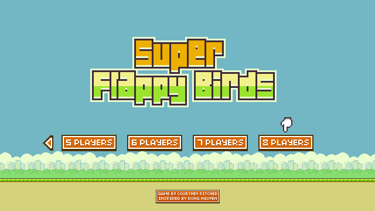
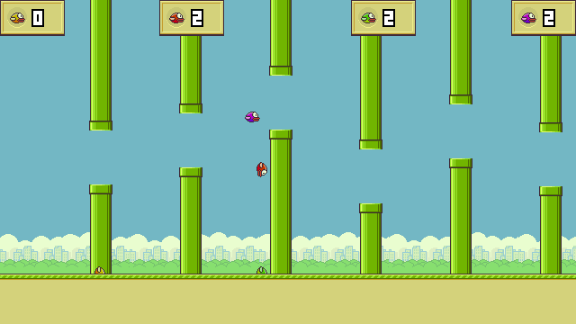
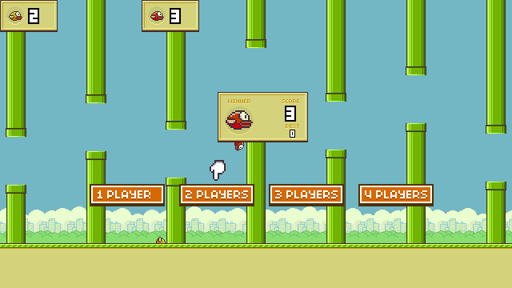

# libretro-superflappybirds
A multiplayer Flappy Bird clone designed for the libretro framework. This game runs on a custom engine that I built myself, scroll down to the bottom of the page to [read more](#about-the-engine).

## Adding to RetroPie

Copy the script `lr-superflappybirds.sh` to `/home/pi/RetroPie-Setup/scriptmodules/libretrocores/lr-superflappybirds.sh` and run it from the `./retropie_setup` menu.

### Step by step:

1. Open the `RetroPie` Menu
2. Select `RetroPie Setup`
3. Select `P  Manage packages`
4. Select `exp     Manage experimental packages`
5. Select `lr-superflappybirds`
6. Select `S  Install from source`

Restart EmulationStation and you should see the game under the ports menu.

## Building from source

    git clone https://github.com/IgniparousTempest/libretro-superflappybirds
    cd libretro-superflappybirds
    cmake .
    make
    retroarch.exe -L superflappybirds_libretro.dll 
    
## About the Engine

The engine is only capable of opening images of the [PNM](https://en.wikipedia.org/wiki/Netpbm_format) family plus the generic extension format [PAM](https://en.wikipedia.org/wiki/Netpbm#PAM_graphics_format). The PNM family only allows RGB images, while the more complex PAM format allows RGB images with transparency. Although any image parser that can translate an image to RGBA can be used with the engine.

The engine allows for screen rendering, collision detection, image translation, and image rotation with cubic filtering. All screen drawing is multi-threaded.

The engine only supports [.wav](http://soundfile.sapp.org/doc/WaveFormat/) files for sound with 16 bit, 2 channel inputs, sampled at 44100 Hz, and encoded with PCM. The sound mixer allows an unlimited number of sounds to be played simultaneously.
